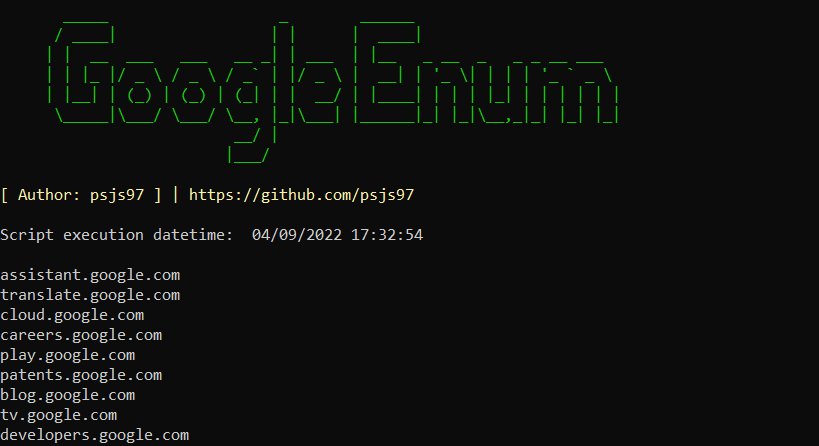

# Google Enum
Get subdomains from a given domain using Google Dorks.

# Installation
python -m pip install beautifulsoup4
python -m pip install google

# Usage 
python google_enum.py [-h] -d DOMAIN [-o OUTPUT]

# Example
 